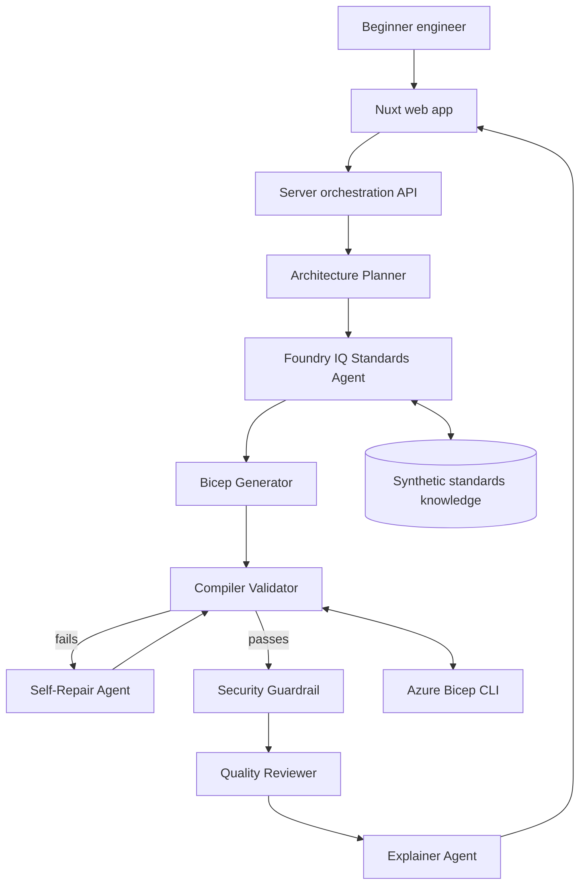

# CloudSchema

CloudSchema is a multi-agent infrastructure reasoning tutor for beginner engineers. It turns a plain-language project description into Azure architecture choices, generates Bicep, validates it with the local Bicep compiler, repairs compiler errors, reviews quality, and explains every generated code block.

## Hackathon Submission

Track: **Battle #2 - Reasoning Agents with Microsoft Foundry**

Submission title: **CloudSchema: Multi-Agent Infrastructure Reasoning Tutor**

One-liner: CloudSchema uses specialised reasoning agents to transform a beginner project idea into validated Azure Bicep, grounded in synthetic enterprise standards and checked by compiler, repair, review, and explanation loops.

Full submission notes: [`docs/REASONING_AGENTS_SUBMISSION.md`](docs/REASONING_AGENTS_SUBMISSION.md)

Architecture diagram: [`docs/ARCHITECTURE.md`](docs/ARCHITECTURE.md)

Submission checklist: [`docs/SUBMISSION_CHECKLIST.md`](docs/SUBMISSION_CHECKLIST.md)

## Stack

- Nuxt 4, Vue 3, TypeScript
- Nuxt server API / Nitro
- Azure OpenAI / Azure AI Foundry for generation and repair when credentials are configured
- Azure CLI / Bicep CLI for local compilation
- Optional Azure Resource Manager REST validation via `@azure/identity`
- Azure AI Search retrievable standards provider, with local Foundry IQ-style fallback in `foundry_iq_knowledge/company_standards.md`

## Multi-Agent Architecture

CloudSchema is implemented as an orchestrated reasoning workflow with specialised agent responsibilities:

- **Architecture Planner** maps the project description and selected modules into an Azure architecture graph.
- **Foundry IQ Standards Agent** retrieves synthetic company infrastructure standards from `foundry_iq_knowledge/company_standards.md`.
- **Bicep Generator** produces an initial infrastructure-as-code template.
- **Compiler Validator** calls `az bicep build` as an external deterministic verifier.
- **Self-Repair Agent** uses compiler feedback to repair invalid Bicep and retry validation.
- **Quality Reviewer** scores security, cost, reliability, maintainability, and alignment with the user goal.
- **Explainer Agent** creates beginner-friendly explanations for each top-level Bicep block.

Reasoning pattern: planner-executor-verifier-repair-critic-explainer.



## Run Locally

```bash
npm install
npm run dev
```

The app works without Azure OpenAI credentials by using a deterministic Bicep generator. Keep `Inject demo compiler error` enabled to demonstrate the self-repair loop.

Run the automated synthetic evaluation suite:

```bash
npm run eval
```

The eval runner starts a local Nuxt server, disables Azure OpenAI credentials for deterministic results, posts synthetic cases to `/api/generate-infra`, and checks compiler success, agent trace coverage, standards grounding, code explanations, and secret guardrails.

## Environment

Copy `.env.example` to `.env` and set values as needed.

Azure OpenAI:

```bash
AZURE_OPENAI_ENDPOINT=https://your-resource.openai.azure.com
AZURE_OPENAI_KEY=your-key
AZURE_OPENAI_DEPLOYMENT=your-chat-deployment
AZURE_OPENAI_API_VERSION=2024-10-21
```

Azure Resource Manager validation:

```bash
az login
AZURE_SUBSCRIPTION_ID=your-subscription-id
AZURE_RESOURCE_GROUP=rg-cloudschema-demo
AZURE_LOCATION=eastus
```

## Demo Flow

1. Describe a beginner project.
2. Select Azure modules such as App Service, Storage, Key Vault, SQL, Functions, and Application Insights.
3. CloudSchema reads Foundry IQ company standards.
4. It generates `main.bicep`.
5. It runs `az bicep build` locally.
6. If the compiler returns an error, the repair agent fixes the Bicep and validates again.
7. The UI shows the agent reasoning trace, architecture graph, quality review, final code, and block-level explanations.

## Microsoft IQ Integration

CloudSchema uses a standards provider boundary for approved infrastructure grounding:

- Real retrieval provider: Azure AI Search index configured with `AZURE_AI_SEARCH_*` environment variables
- Local fallback provider: `foundry_iq_knowledge/company_standards.md`
- Purpose: ground generation, repair, review, and explanation in organisation-approved Azure rules
- Examples: required `owner` and `environment` tags, HTTPS-only storage, TLS 1.2, no hard-coded secrets

The API returns `standardsProvider` and `standardsCitations` so the UI can show exactly which knowledge source grounded the run.

The code also supports Azure OpenAI / Azure AI Foundry configuration through environment variables. If no credentials are configured, the app uses deterministic local fallbacks so the demo remains reliable.

## Evaluation

The synthetic evaluation set is in [`evals/reasoning-agent-evals.json`](evals/reasoning-agent-evals.json). It covers:

- grounded standards application
- compiler failure and repair
- safe secret handling
- block-level explanation coverage
- quality review signal

Use these prompts during the demo or as manual regression checks before submission.

## Safety

CloudSchema is for learning and review. It does not deploy infrastructure automatically, does not store real secrets, and generated templates should be reviewed before production use.

This repository uses synthetic demo data only. Do not commit `.env`, credentials, production Bicep files, customer data, employee data, or proprietary internal documents.
