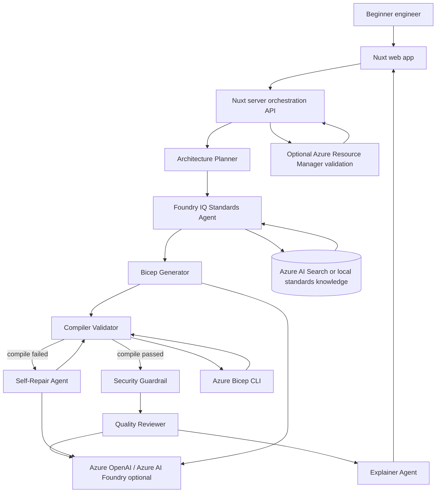

# Architecture Diagram

CloudSchema is an orchestrated multi-agent reasoning workflow for the Reasoning Agents track.

## Components

- **Nuxt web app**: collects the project description, selected modules, owner, environment, and demo options.
- **Nuxt server orchestration API**: coordinates the agent workflow and returns the reasoning trace.
- **Foundry IQ Standards Agent**: grounds generation and review in approved infrastructure standards retrieved from Azure AI Search or the local fallback document.
- **Azure Bicep CLI**: deterministic external verifier used to compile generated Bicep.
- **Self-Repair Agent**: consumes compiler diagnostics and produces a revised template.
- **Security Guardrail**: scans final Bicep for hard-coded secret patterns before returning the response.
- **Quality Reviewer**: reviews the final template for security, cost, reliability, maintainability, and alignment.
- **Explainer Agent**: explains each top-level Bicep block for beginner learning.

## Microsoft Foundry / IQ Usage

- Real retrievable source: Azure AI Search index configured through `AZURE_AI_SEARCH_ENDPOINT`, `AZURE_AI_SEARCH_INDEX_NAME`, and either `AZURE_AI_SEARCH_KEY` or managed identity.
- Local fallback source: `foundry_iq_knowledge/company_standards.md`
- Optional Azure OpenAI / Azure AI Foundry configuration: `.env.example`
- Optional ARM validation: uses `DefaultAzureCredential` and `az login`
- Runtime response includes `standardsProvider` and `standardsCitations` for auditability.

## Demo Guarantee

The project can run without Azure OpenAI credentials using deterministic fallbacks. This keeps the hackathon demo reliable while still showing where Foundry-hosted models and Foundry IQ grounding fit into the production deployment story.

## Evaluation and Deployment

- `npm run eval` starts a local Nuxt server and validates synthetic Reasoning Agents scenarios end to end.
- `Dockerfile` packages the Nuxt/Nitro app for container hosting or a future Foundry Agent Service hosted-agent deployment path.
