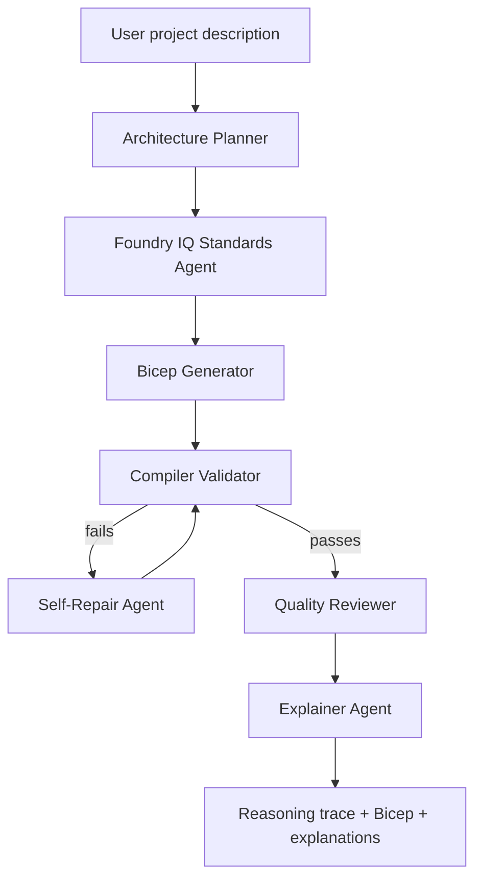

# Reasoning Agents Submission

## Project

**CloudSchema: Multi-Agent Infrastructure Reasoning Tutor**

CloudSchema helps beginner engineers learn Azure infrastructure by turning a project description into validated Bicep. The system reasons through architecture planning, grounded standards retrieval, code generation, compiler validation, self-repair, quality review, and block-level explanation.

## Track Fit

Track: **Battle #2 - Reasoning Agents with Microsoft Foundry**

CloudSchema aligns with the Reasoning Agents challenge because it demonstrates:

- multi-step reasoning across planning, generation, verification, repair, review, and explanation
- specialised agent responsibilities coordinated by a server-side orchestration workflow
- Microsoft IQ grounding through a retrievable standards provider with citations and local fallback
- external tool integration with the Azure Bicep CLI compiler
- reliability and safety controls for secrets, synthetic data, and review-before-deploy workflows

## User Scenario

A beginner engineer describes an application, chooses Azure modules, and asks CloudSchema to produce understandable infrastructure. CloudSchema returns a validated Bicep template, explains the generated architecture, shows compiler repair history, and teaches what every code block does.

Example prompt:

> I am building a small SaaS app with a web frontend, an API, file uploads, monitoring, and safe secret storage.

## Agent Architecture

| Agent | Responsibility | Inputs | Outputs |
| --- | --- | --- | --- |
| Architecture Planner | Maps the project description and selected modules to an Azure architecture graph | user prompt, selected modules | architecture graph, module summary |
| Foundry IQ Standards Agent | Retrieves approved synthetic infrastructure standards | `foundry_iq_knowledge/company_standards.md` | standards applied to generation and review |
| Bicep Generator | Produces initial Bicep | project summary, modules, standards | `main.bicep` candidate |
| Compiler Validator | Verifies Bicep with an external deterministic tool | Bicep candidate | compile pass/fail, compiler diagnostics |
| Self-Repair Agent | Repairs invalid Bicep from compiler feedback | Bicep candidate, compiler diagnostics | revised Bicep candidate |
| Quality Reviewer | Critiques final template | final Bicep, project goal, standards | score, pass/fail, issues, suggestions |
| Explainer Agent | Explains generated code for learning | final Bicep, selected modules | block-level explanations for params, vars, resources, outputs |

## Reasoning Flow



## Microsoft IQ Integration

CloudSchema uses a standards provider boundary to ground generated infrastructure in approved enterprise rules.

Knowledge sources:

- Azure AI Search index when `AZURE_AI_SEARCH_*` configuration is present
- `foundry_iq_knowledge/company_standards.md` as the local Foundry IQ-style fallback

Grounded standards include:

- every Azure resource must include `owner` and `environment` tags
- storage accounts must enforce HTTPS-only traffic and TLS 1.2+
- generated templates must avoid real secrets and hard-coded credentials
- beginner demos should prefer small, understandable infrastructure patterns

The app is configured for Azure OpenAI / Azure AI Foundry when credentials are available, with deterministic fallback behaviour for reliable demos.

Each generation response includes `standardsProvider` and `standardsCitations`, which are displayed in the UI so the demo can show the grounding source used for the run.

## External Tools

- `az bicep build --file main.bicep --outfile main.json` validates generated Bicep.
- Optional Azure Resource Manager validation uses `DefaultAzureCredential` and `az login`.
- Mermaid renders the architecture graph.
- Highlight.js powers interactive Bicep explanations in the UI.
- `npm run eval` runs synthetic end-to-end checks against the orchestration API.

## Reasoning Patterns Demonstrated

- Planner-executor: planning is separated from Bicep generation.
- Verifier: Bicep CLI provides deterministic compiler validation.
- Repair loop: invalid Bicep is repaired and recompiled up to three attempts.
- Critic: quality review scores the final template and lists issues.
- Explainer: every top-level code block receives a beginner-friendly explanation.
- Grounded generation: standards are retrieved from Azure AI Search or a local approved synthetic knowledge source with citations.
- Safety guardrail: final Bicep is scanned for hard-coded secret patterns before the response is returned.

## Demo Script

1. Start the app with `npm run dev`.
2. Use the default project prompt or generate an AI example.
3. Select App Service, Storage Account, Key Vault, and Application Insights.
4. Keep `Inject demo compiler error` enabled to show the repair loop.
5. Click **Generate Bicep**.
6. Show the agent reasoning trace: generated, compile failed, repaired, compile passed.
7. Show the quality review score and summary.
8. Hover over Bicep blocks to show explanations for parameters, variables, resources, and outputs.
9. Explain that no deployment happens automatically and all data is synthetic/demo-safe.

## Evaluation Plan

Manual evaluation cases are stored in `evals/reasoning-agent-evals.json`.

Run them with:

```bash
npm run eval
```

Evaluation checks:

- selected modules appear in final Bicep
- standards are applied consistently
- compiler failure can trigger repair
- no real secrets are generated
- quality review identifies meaningful risk areas
- every top-level Bicep block has an explanation
- deploy commands are suggestions only, not automatic deployment

## Safety and Responsible AI

CloudSchema is designed for learning and review, not automatic production deployment.

Safety controls:

- synthetic standards and prompts only
- no customer data, employee data, PII, secrets, or proprietary documents
- `.env` and generated deployment files are gitignored
- generated templates avoid hard-coded credentials
- Azure validation is optional and user-controlled
- final templates are explicitly marked for human review before production use

## Hosted Deployment Story

For a production-minded Reasoning Agents deployment, CloudSchema can be packaged as a hosted agent endpoint in Foundry Agent Service:

- containerise the Nuxt/Nitro server
- use Azure Container Registry for image storage
- assign managed identity for Azure services
- connect Foundry IQ as the enterprise standards knowledge source
- emit telemetry for generation attempts, compiler results, repair counts, quality scores, and explanation coverage

The repository includes a `Dockerfile` for this deployment path. The current hackathon build focuses on a reliable local demo with optional Azure OpenAI / Foundry configuration.
